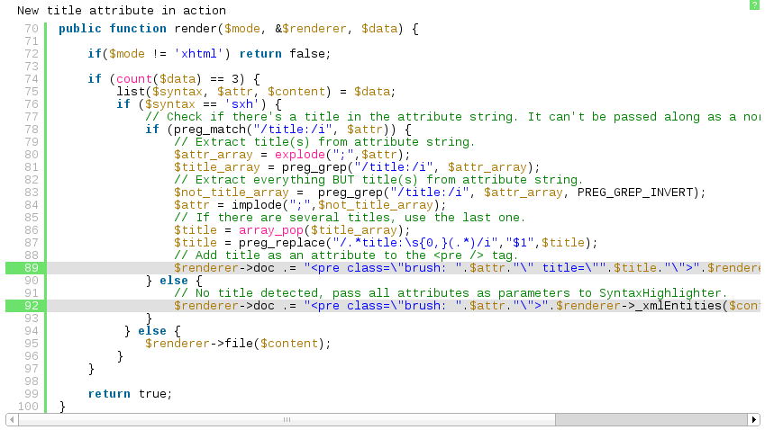
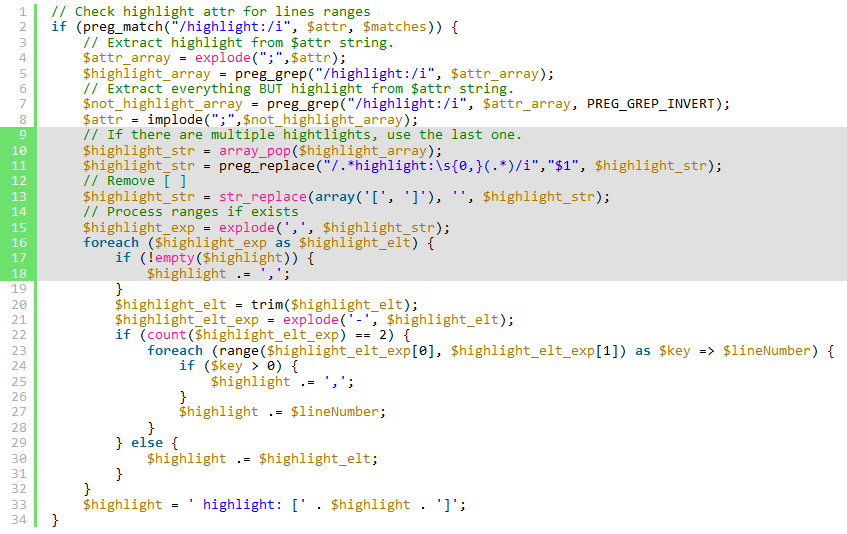

:boom: **[SyntaxHighlighter 4 Plugin](https://github.com/crazy-max/dokuwiki-plugin-syntaxhighlighter4) is now available!** :boom:

<p align="center">
  <a href="https://github.com/crazy-max/dokuwiki-plugin-syntaxhighlighter3/releases"></a>
  <a href="https://www.dokuwiki.org/releasenames"></a>
  <a href="https://www.codacy.com/app/crazy-max/dokuwiki-plugin-syntaxhighlighter3"></a>
  <a href="https://styleci.io/repos/61027126"></a>
  <a href="https://beerpay.io/crazy-max/dokuwiki-plugin-syntaxhighlighter4"></a>
  <a href="https://www.paypal.com/cgi-bin/webscr?cmd=_s-xclick&hosted_button_id=NMMSKWE5DPNFU"></a>
</p>

## About

This plugin is an alternative to GeSHi server-side code highlighting of DokuWiki with client-side [SyntaxHighlighter](http://alexgorbatchev.com/wiki/SyntaxHighlighter) by Alex Gorbatchev with copy to clipboard functionality based on [SyntaxHighlighter DokuWiki Plugin by David Shin](https://www.dokuwiki.org/plugin:syntaxhighlighter2).<br />

The subfolder `sxh3` contains an untouched build of [SyntaxHighlighter 3.0.90](https://github.com/syntaxhighlighter/syntaxhighlighter/releases/tag/v3.0.90).<br />

For compatibility and conflicts with others plugins, please refer to the official [DokuWiki SyntaxHighlighter3 plugin page](http://www.dokuwiki.org/plugin:syntaxhighlighter3). 

## Download and Installation

Download and install the plugin using the [Plugin Manager](https://www.dokuwiki.org/plugin:plugin) using the download link given above. Refer to [Plugins](https://www.dokuwiki.org/plugins) on how to install plugins manually.<br />

If you install this plugin manually, make sure it is installed in `lib/plugins/syntaxhighlighter3/`. If the folder is called different it will not work!

## Syntax and Usage

* Does not use `<code>` tags, enables parallell use with DokuWikis own server side syntax highlighter (GeSHi).
* Does not require Flash for copy to clipboard functionality.

Usage:
```
<sxh [brush alias][; options for SyntaxHighlighter]>
... code/text ...
</sxh>
```

### Brush alias

The brush alias (language) that SyntaxHighlighter should use. Defaults to "text" if none is provided. See [SyntaxHighlighter Brushes](http://alexgorbatchev.com/SyntaxHighlighter/manual/brushes/) for a complete list of available brushes.<br />
Add new brushes to the scripts directory and the alias(es) and brush file name to the available brushes string in [Config Manager](https://www.dokuwiki.org/plugin:config) (example: "...,bat cmd shBrushBat.js"). The brush file name is case sensitive.

### Options

Semicolon separated options for SyntaxHighlighter, see [SyntaxHighlighter Configuration](http://alexgorbatchev.com/SyntaxHighlighter/manual/configuration/).<br />
[Block Title](http://alexgorbatchev.com/SyntaxHighlighter/whatsnew.html#blocktitle) isn't a normal configuration option, but the plugin handles it as if it was, i.e. `title: <title string>;`.

> Do not collapse code and hide the toolbar at the same time, title will not show.

### Defaults

Some [Syntaxhighlighter defaults](http://alexgorbatchev.com/SyntaxHighlighter/manual/configuration/#syntaxhighlighterdefaults) can be overrided via the [Config Manager](https://www.dokuwiki.org/plugin:config) :
* **auto-links**: Allows you to turn detection of links in the highlighted element on and off. If the option is turned off, URLs won’t be clickable `(default on)`
* **collapse**: Allows you to force highlighted elements on the page to be collapsed by default `(default off)`
* **first-line**: Allows you to change the first (starting) line number `(default 1)`
* **gutter**: Allows you to turn gutter with line numbers on and off `(default on)`
* **html-script**: Allows you to highlight a mixture of HTML/XML code and a script which is very common in web development. Setting this value to true requires that you have shBrushXml.js loaded and that the brush you are using supports this feature `(default off)`
* **smart-tabs**: Allows you to turn smart tabs feature on and off `(default on)`
* **tab-size**: Allows you to adjust tab size `(default 4)`
* **toolbar**: Toggles toolbar on/off `(default on)`

## Example

```
<sxh php; first-line: 70; highlight: [89,92]; title: New title attribute in action>
    public function render($mode, &$renderer, $data) {
 
        if($mode != 'xhtml') return false;
 
        if (count($data) == 3) {
            list($syntax, $attr, $content) = $data;
            if ($syntax == 'sxh') {
                // Check if there's a title in the attribute string. It can't be passed along as a normal parameter to SyntaxHighlighter.
                if (preg_match("/title:/i", $attr)) {
                    // Extract title(s) from attribute string.
                    $attr_array = explode(";",$attr);
                    $title_array = preg_grep("/title:/i", $attr_array);
                    // Extract everything BUT title(s) from attribute string.
                    $not_title_array =  preg_grep("/title:/i", $attr_array, PREG_GREP_INVERT);
                    $attr = implode(";",$not_title_array);
                    // If there are several titles, use the last one.
                    $title = array_pop($title_array);
                    $title = preg_replace("/.*title:\s{0,}(.*)/i","$1",$title);
                    // Add title as an attribute to the <pre /> tag.
                    $renderer->doc .= "<pre class=\"brush: ".$attr."\" title=\"".$title."\">".$renderer->_xmlEntities($content)."</pre>";
                } else {
                    // No title detected, pass all attributes as parameters to SyntaxHighlighter.
                    $renderer->doc .= "<pre class=\"brush: ".$attr."\">".$renderer->_xmlEntities($content)."</pre>";
                }
             } else {
                $renderer->file($content);
            }
        }
 
        return true;
    }
</sxh>
```

Expected result:



## Features

### Copy to clipboard

Double click anywhere inside SyntaxHighlighter code area to highlight the text and then copy it using Ctrl/Cmd+C or mouse right click > Copy.<br />
Click outside the code area to restore highlighting.

### Highlight a range of lines

Example:

```
<sxh php; highlight: [9-18]>
// Check highlight attr for lines ranges
if (preg_match("/highlight:/i", $attr, $matches)) {
    // Extract highlight from $attr string.
    $attr_array = explode(";",$attr);
    $highlight_array = preg_grep("/highlight:/i", $attr_array);
    // Extract everything BUT highlight from $attr string.
    $not_highlight_array = preg_grep("/highlight:/i", $attr_array, PREG_GREP_INVERT);
    $attr = implode(";",$not_highlight_array);
    // If there are multiple hightlights, use the last one.
    $highlight_str = array_pop($highlight_array);
    $highlight_str = preg_replace("/.*highlight:\s{0,}(.*)/i","$1", $highlight_str);
    // Remove [ ]
    $highlight_str = str_replace(array('[', ']'), '', $highlight_str);
    // Process ranges if exists
    $highlight_exp = explode(',', $highlight_str);
    foreach ($highlight_exp as $highlight_elt) {
        if (!empty($highlight)) {
            $highlight .= ',';
        }
        $highlight_elt = trim($highlight_elt);
        $highlight_elt_exp = explode('-', $highlight_elt);
        if (count($highlight_elt_exp) == 2) {
            foreach (range($highlight_elt_exp[0], $highlight_elt_exp[1]) as $key => $lineNumber) {
                if ($key > 0) {
                    $highlight .= ',';
                }
                $highlight .= $lineNumber;
            }
        } else {
            $highlight .= $highlight_elt;
        }
    }
    $highlight = ' highlight: [' . $highlight . ']';
}
</sxh>
```

Expected result:



## Issues and Features

* https://github.com/crazy-max/dokuwiki-plugin-syntaxhighlighter3/issues

## Changelog

See `CHANGELOG.md`.

## How can i help ?

All kinds of contributions are welcomed :raised_hands:!<br />
The most basic way to show your support is to star :star2: the project, or to raise issues :speech_balloon:<br />
But we're not gonna lie to each other, I'd rather you buy me a beer or two :beers:!

[](https://beerpay.io/crazy-max/dokuwiki-plugin-syntaxhighlighter4)
or [](https://www.paypal.com/cgi-bin/webscr?cmd=_s-xclick&hosted_button_id=NMMSKWE5DPNFU)

## License

> This is a modified version (fork) of SyntaxHighlighter3 Plugin for DokuWiki based on Daniel Lindgren's work.

GPLv2. See `LICENSE` for more details.
